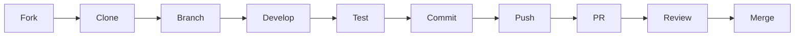

# 🤝 Guía de Contribución - Flamenco Fusion Hub

¡Gracias por tu interés en contribuir a Flamenco Fusion Hub! Este documento te guiará a través del proceso de contribución.

## 📋 Índice

- [Código de Conducta](#código-de-conducta)
- [Cómo Contribuir](#cómo-contribuir)
- [Configuración del Entorno](#configuración-del-entorno)
- [Proceso de Desarrollo](#proceso-de-desarrollo)
- [Estándares de Código](#estándares-de-código)
- [Testing](#testing)
- [Documentación](#documentación)
- [Reportar Issues](#reportar-issues)
- [Pull Requests](#pull-requests)

---

## 📜 Código de Conducta

Este proyecto sigue un código de conducta para asegurar un ambiente acogedor para todos los contribuidores. Al participar, te comprometes a:

- Ser respetuoso y inclusivo
- Aceptar críticas constructivas
- Enfocarte en lo que es mejor para la comunidad
- Mostrar empatía hacia otros miembros

---

## 🚀 Cómo Contribuir

### **Tipos de Contribuciones**

- 🐛 **Reportar bugs**
- 💡 **Sugerir nuevas funcionalidades**
- 📝 **Mejorar documentación**
- 🔧 **Corregir bugs**
- ✨ **Implementar nuevas funcionalidades**
- 🧪 **Mejorar tests**
- 🎨 **Mejorar UI/UX**

### **Primeros Pasos**

1. **Fork** el repositorio
2. **Clone** tu fork localmente
3. **Crea** una rama para tu feature
4. **Haz** tus cambios
5. **Testea** tus cambios
6. **Commit** tus cambios
7. **Push** a tu fork
8. **Abre** un Pull Request

---

## ⚙️ Configuración del Entorno

### **Prerrequisitos**

- Node.js 18+
- npm o yarn
- Git
- Cuenta de GitHub

### **Instalación**

```bash
# 1. Fork y clona el repositorio
git clone https://github.com/tu-usuario/flamenco-fusion-hub.git
cd flamenco-fusion-hub

# 2. Instala dependencias
npm install

# 3. Configura variables de entorno
cp .env.example .env
cp supabase/functions/.env.example supabase/functions/.env

# 4. Edita ambos archivos .env con tus credenciales:
# - .env: Variables para el frontend (VITE_*)
# - supabase/functions/.env: Variables para Edge Functions

# 5. Inicia en modo desarrollo
npm run dev
```

### **Configuración de Variables de Entorno**

#### **Archivos de Configuración**
El proyecto incluye dos archivos `.env.example` que debes copiar:

1. **`.env.example`** (raíz del proyecto) → **`.env`**
   - Variables para el frontend (prefijo `VITE_`)
   - Configuración de Supabase, WooCommerce, etc.

2. **`supabase/functions/.env.example`** → **`supabase/functions/.env`**
   - Variables para Edge Functions
   - APIs externas (Holded, Twilio, Resend)

#### **Variables Principales**
```bash
# Frontend (.env)
VITE_SUPABASE_URL=https://tu-proyecto.supabase.co
VITE_SUPABASE_ANON_KEY=tu_supabase_anon_key
VITE_WOOCOMMERCE_URL=https://tu-tienda.com
VITE_WOOCOMMERCE_CONSUMER_KEY=ck_tu_consumer_key
VITE_WOOCOMMERCE_CONSUMER_SECRET=cs_tu_consumer_secret

# Edge Functions (supabase/functions/.env)
SUPABASE_URL=https://tu-proyecto.supabase.co
SUPABASE_SERVICE_ROLE_KEY=tu_service_role_key
HOLDED_API_KEY=tu_holded_api_key
TWILIO_ACCOUNT_SID=tu_twilio_sid
TWILIO_AUTH_TOKEN=tu_twilio_token
```

### **Configuración de Supabase**

```bash
# Instala Supabase CLI
npm install -g supabase

# Inicializa Supabase
supabase init

# Despliega Edge Functions
supabase functions deploy
```

---

## 🔄 Proceso de Desarrollo

### **Flujo de Trabajo**



### **Nomenclatura de Ramas**

```bash
# Features
feature/nombre-de-la-funcionalidad
feature/user-authentication
feature/payment-integration

# Bug fixes
fix/descripcion-del-bug
fix/login-error
fix/stock-sync-issue

# Documentation
docs/descripcion
docs/api-documentation
docs/setup-guide

# Refactoring
refactor/componente-o-funcion
refactor/user-management
refactor/database-schema
```

### **Commits**

Usa el formato de commits convencionales:

```bash
# Tipos de commit
feat: nueva funcionalidad
fix: corrección de bug
docs: cambios en documentación
style: cambios de formato
refactor: refactorización de código
test: agregar o modificar tests
chore: tareas de mantenimiento

# Ejemplos
feat: agregar sistema de notificaciones push
fix: corregir error de sincronización de stock
docs: actualizar guía de instalación
test: agregar tests para componente Button
```

---

## 📏 Estándares de Código

### **TypeScript**

```typescript
// ✅ Bueno
interface UserProps {
  id: string;
  name: string;
  email: string;
  role: UserRole;
}

const UserComponent: React.FC<UserProps> = ({ id, name, email, role }) => {
  return (
    <div className="user-card">
      <h3>{name}</h3>
      <p>{email}</p>
      <span className={`role role--${role}`}>{role}</span>
    </div>
  );
};

// ❌ Evitar
const UserComponent = (props) => {
  return <div>{props.name}</div>;
};
```

### **React**

```typescript
// ✅ Usar hooks personalizados
const { products, loading, error } = useWooCommerceProducts();

// ✅ Manejar estados de carga
if (loading) return <LoadingSpinner />;
if (error) return <ErrorMessage error={error} />;

// ✅ Usar TypeScript
const handleSubmit = (data: FormData): void => {
  // lógica
};
```

### **CSS/Tailwind**

```typescript
// ✅ Usar clases de Tailwind
<div className="flex items-center justify-between p-4 bg-white rounded-lg shadow-md">

// ✅ Componentes con variantes
<Button variant="primary" size="large">
  Guardar
</Button>

// ❌ Evitar estilos inline
<div style={{ display: 'flex', padding: '16px' }}>
```

### **Nomenclatura**

```typescript
// ✅ Componentes: PascalCase
const UserProfile = () => {};

// ✅ Hooks: camelCase con prefijo 'use'
const useUserData = () => {};

// ✅ Funciones: camelCase
const calculateTotal = () => {};

// ✅ Constantes: UPPER_SNAKE_CASE
const API_BASE_URL = 'https://api.example.com';

// ✅ Tipos/Interfaces: PascalCase
interface UserData {
  id: string;
  name: string;
}
```

---

## 🧪 Testing

### **Escribir Tests**

```typescript
// Ejemplo de test de componente
import { render, screen, fireEvent } from '@testing-library/react';
import { Button } from '@/components/ui/button';

describe('Button Component', () => {
  it('should render with correct text', () => {
    render(<Button>Click me</Button>);
    expect(screen.getByText('Click me')).toBeInTheDocument();
  });

  it('should handle click events', () => {
    const handleClick = vi.fn();
    render(<Button onClick={handleClick}>Click me</Button>);
    
    fireEvent.click(screen.getByText('Click me'));
    expect(handleClick).toHaveBeenCalledTimes(1);
  });
});
```

### **Ejecutar Tests**

```bash
# Ejecutar todos los tests
npm run test:run

# Modo watch
npm run test

# Con cobertura
npm run test:coverage

# Tests específicos
npm run test Button.test.tsx
```

### **Cobertura Mínima**

- **Componentes**: 80%
- **Hooks**: 90%
- **Utilidades**: 95%
- **Funciones críticas**: 100%

---

## 📚 Documentación

### **Documentar Código**

```typescript
/**
 * Calcula el total de un pedido incluyendo IVA
 * @param items - Array de items del pedido
 * @param ivaRate - Tasa de IVA (por defecto 0.21)
 * @returns Total calculado con IVA
 */
const calculateOrderTotal = (
  items: OrderItem[],
  ivaRate: number = 0.21
): number => {
  const subtotal = items.reduce((sum, item) => sum + item.price * item.quantity, 0);
  return subtotal * (1 + ivaRate);
};
```

### **Actualizar Documentación**

- Actualiza README.md si cambias la instalación
- Actualiza DOCUMENTACION_TECNICA.md si cambias la arquitectura
- Agrega comentarios JSDoc a funciones públicas
- Documenta APIs y endpoints nuevos

---

## 🐛 Reportar Issues

### **Antes de Reportar**

1. Busca en issues existentes
2. Verifica que no sea un duplicado
3. Asegúrate de usar la versión más reciente

### **Template de Bug Report**

```markdown
## 🐛 Descripción del Bug
Descripción clara y concisa del problema.

## 🔄 Pasos para Reproducir
1. Ve a '...'
2. Haz clic en '...'
3. Scroll hasta '...'
4. Ve el error

## ✅ Comportamiento Esperado
Descripción de lo que debería pasar.

## 📱 Información del Sistema
- OS: [e.g. Windows 10, macOS 12, Ubuntu 20.04]
- Navegador: [e.g. Chrome 95, Firefox 94, Safari 15]
- Versión: [e.g. 1.2.3]

## 📸 Screenshots
Si aplica, agrega screenshots.

## 📋 Contexto Adicional
Cualquier otra información relevante.
```

### **Template de Feature Request**

```markdown
## 💡 Descripción de la Funcionalidad
Descripción clara de la funcionalidad que te gustaría ver.

## 🎯 Problema que Resuelve
¿Qué problema resuelve esta funcionalidad?

## 💭 Solución Propuesta
Describe la solución que tienes en mente.

## 🔄 Alternativas Consideradas
Describe alternativas que has considerado.

## 📋 Contexto Adicional
Cualquier otra información relevante.
```

---

## 🔀 Pull Requests

### **Antes de Abrir un PR**

- [ ] Tests pasan (`npm run test:run`)
- [ ] Linting pasa (`npm run lint`)
- [ ] Build exitoso (`npm run build`)
- [ ] Documentación actualizada
- [ ] Commits con mensajes descriptivos

### **Template de PR**

```markdown
## 📝 Descripción
Descripción clara de los cambios realizados.

## 🔗 Tipo de Cambio
- [ ] Bug fix
- [ ] Nueva funcionalidad
- [ ] Breaking change
- [ ] Documentación

## 🧪 Testing
- [ ] Tests unitarios agregados/actualizados
- [ ] Tests de integración agregados/actualizados
- [ ] Tests manuales realizados

## 📸 Screenshots
Si aplica, agrega screenshots.

## 📋 Checklist
- [ ] Código sigue los estándares del proyecto
- [ ] Self-review del código realizado
- [ ] Comentarios agregados donde sea necesario
- [ ] Documentación actualizada
- [ ] No hay warnings de build
```

### **Proceso de Review**

1. **Automático**: Tests y linting
2. **Manual**: Review de código por maintainers
3. **Feedback**: Comentarios y sugerencias
4. **Iteración**: Ajustes basados en feedback
5. **Aprobación**: Merge a main

---

## 🏷️ Etiquetas de Issues

### **Por Tipo**
- `bug`: Algo no funciona
- `enhancement`: Nueva funcionalidad
- `documentation`: Mejoras en documentación
- `question`: Pregunta o duda

### **Por Prioridad**
- `priority: high`: Crítico
- `priority: medium`: Importante
- `priority: low`: Mejora menor

### **Por Estado**
- `status: needs-triage`: Necesita revisión
- `status: in-progress`: En desarrollo
- `status: blocked`: Bloqueado
- `status: needs-review`: Necesita review

---

## 🎯 Roadmap

### **Próximas Funcionalidades**

- [ ] **App Móvil**: Versión nativa
- [ ] **IA Integrada**: Recomendaciones
- [ ] **Analytics**: Métricas avanzadas
- [ ] **Multi-tienda**: Múltiples ubicaciones
- [ ] **CRM**: Gestión de clientes

### **Mejoras Técnicas**

- [ ] **PWA**: Aplicación web progresiva
- [ ] **Microservicios**: Arquitectura escalable
- [ ] **CI/CD**: Pipeline automático
- [ ] **Monitoreo**: Observabilidad completa

---

## 📞 Contacto

### **Para Contribuidores**

- 💬 **Discord**: [Canal de desarrolladores](https://discord.gg/flamencafusion)
- 📧 **Email**: dev@flamencafusion.com
- 🐛 **Issues**: [GitHub Issues](https://github.com/tu-usuario/flamenco-fusion-hub/issues)

### **Para Maintainers**

- 📧 **Email**: maintainers@flamencafusion.com
- 🔒 **Security**: security@flamencafusion.com

---

## 🙏 Reconocimientos

Gracias a todos los contribuidores que hacen posible este proyecto:

- **Desarrolladores**: Por el código y funcionalidades
- **Testers**: Por encontrar bugs y mejorar calidad
- **Documentadores**: Por mantener la documentación actualizada
- **Comunidad**: Por feedback y sugerencias

---

**¡Gracias por contribuir a Flamenco Fusion Hub!** 🎭✨
